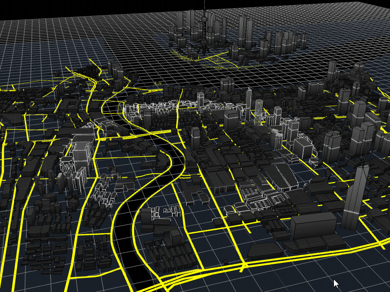
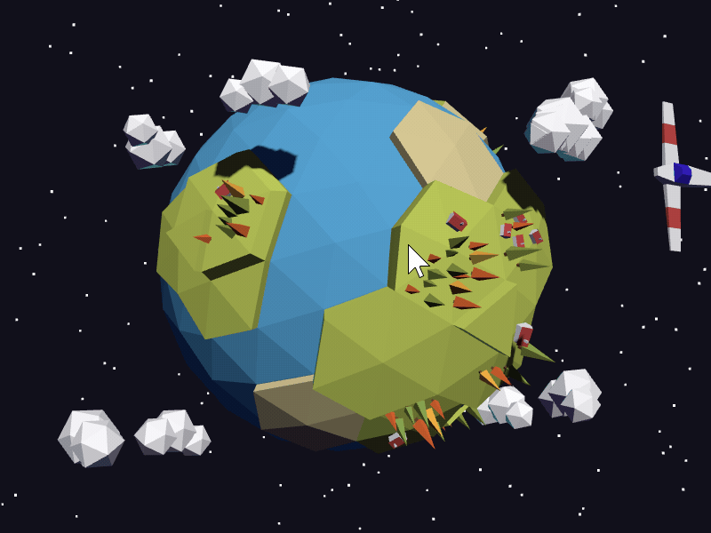
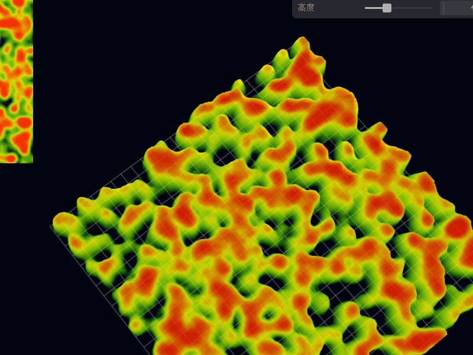
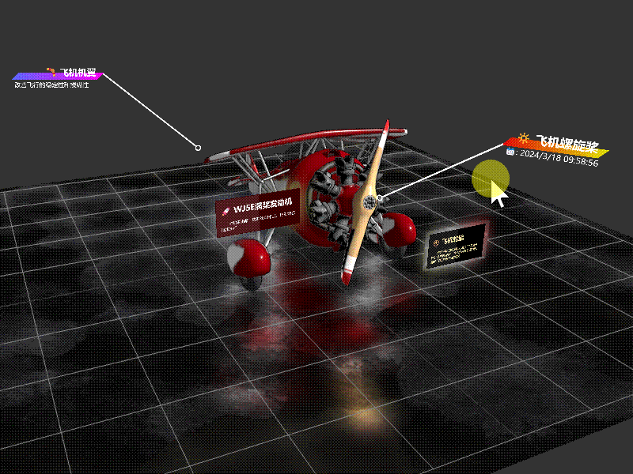
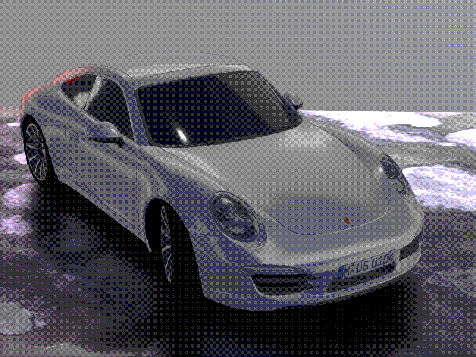
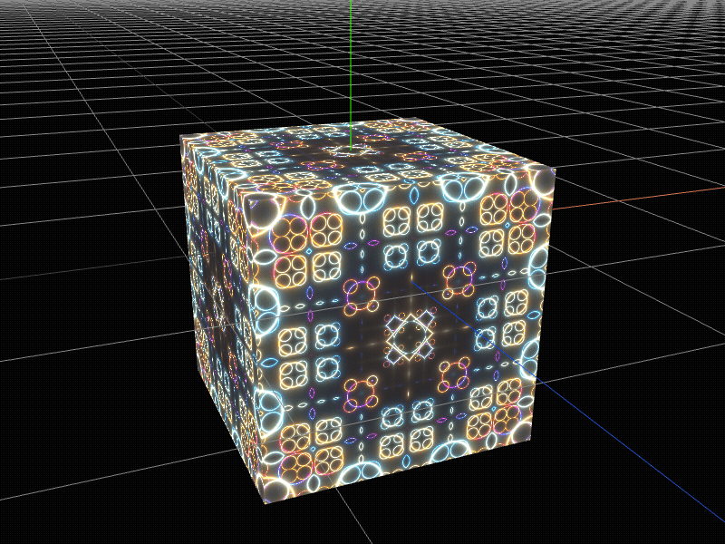
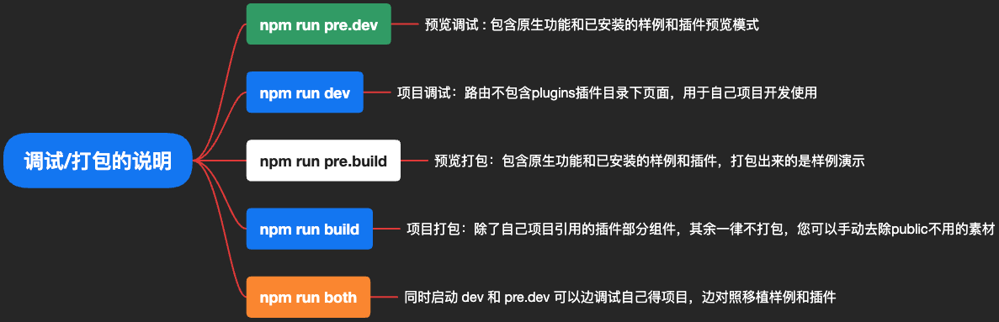

# 🧊🧊🧊 icegl-three-vue-tres 🧊🧊🧊

## 🎉🎉🎊 三维可视化项目快速落地の开源框架 🎊🎉🎉

<p align="center">
    <a target="_black" href="https://space.bilibili.com/410503457">
       
    </a>
    <a target="_black" href="https://gitee.com/ice-gl/icegl-three-vue-tres">
      
    </a>
    <a target="_black" href="https://afdian.net/@tvt_js">
      
    </a>
</p>

## 🧊🧊🧊🧊🧊🧊🧊🧊🧊🧊🧊🧊🧊🧊🧊🧊🧊🧊🧊🧊

```shell
如果对您有帮助，您可以点右上角 “Star” 收藏一下 ，您的star就是我开发的动力，感谢！
```

# 生态 `@ThreeJS-@Vue3.x-@TresJS`

> icegl 出品，永久开源且免费商用，持续更新 ing，请点击右上角 start⭐ 关注

本项目融合于三大生态系统中：

-   🎲 ThreeJS \* [点击详情](https://threejs.org)
    <a href="https://www.npmjs.com/package/three">
    
    </a>
    ThreeJS 大名鼎鼎的基于浏览器渲染，JavaScript 语言的 3D 库。<br/><br/>

-   🍀 Vue3.x \* [点击详情](https://cn.vuejs.org)
    <a href="https://www.npmjs.com/package/vue">
    
    </a>
    易学易用，性能出色，适用场景丰富的 Web 前端框架。<br/><br/>

-   ⚡ TresJS \* [点击详情](https://tresjs.org)

<a href="https://www.npmjs.com/package/@tresjs/core"></a>
使用 Vue3.x 组件实现声明式的 ThreeJS，做属于前端的三维项目。<br/><br/>

## 🏕 点击预览：[🌏opensource.icegl.cn](https://opensource.icegl.cn)

-   如果访问太慢，请访问镜像站点：[🌏 ice-gl.gitee.io/icegl-three-vue-tres](https://ice-gl.gitee.io/icegl-three-vue-tres/)
-   如果有条件翻墙，也可直接访问 github 的镜像站:[🌏 https://hawk86104.github.io](https://hawk86104.github.io/)

```shell
因项目经常更新编译，如发现访问错误，请清空浏览器缓存。
```











更多演示请进入预览页面

# 优势

-   🌈 前端の基本素养 \* FesJS [点击详情](https://fesjs.mumblefe.cn)
    <a href="https://www.npmjs.com/package/@fesjs/fes">
    
    </a>
    集成封装项目落地的常用库：图标、多语言、API 接口调用、Vuex/Pinia、model 数据封装、页面 layout/权限 access、路由管理等。<br/>

-   🌠 像写 Vue3.x 一样写三维可视化项目[点击详情](https://tresjs.org/guide)

全功能版本追溯保持 threeJS 最新版本 \* TresJS
最新 Vue3.x 的语法糖写法，TS/JS 通吃，让你以最新最爽快的方式构建三维可视化项目

```html
<template>
    <TresCanvas window-size>
        <TresPerspectiveCamera />
        <TresMesh>
            <TresTorusGeometry :args="[1, 0.5, 16, 32]" />
            <TresMeshBasicMaterial color="orange" />
        </TresMesh>
    </TresCanvas>
</template>
<script setup lang="ts">
    import { useRenderLoop, useTexture } from '@tresjs/core';
    //读取材质
    const pTexture = await useTexture(['./**.jpg', './**.png']);
    const { onLoop } = useRenderLoop();
    onLoop(({ delta }) => {
        //循环render
    });
</script>
```

-   🧩 丰富的插件应用市场<br/>
    插件中心包含各式各样的项目场景和功能。插件是 ICE 社区生态中重要的一环，在应用市场中完整应用和普通插件统一称为插件。

### 我们将会逐一把落地的项目以插件的形式加入到此开源框中...

### 敬请右上角一键三连: 关注 💛 点赞 ⭐ fork👣

# ✅ 快速开始

```
1、git clone 或者 直接下载 本项目

2、cd 到项目根目录

3、yarn	//安装依赖

4、yarn pre.dev	// 预览 下的调试模式

5、yarn dev // 自己项目 下的调试模式

6、yarn pre.build	//预览 下的编译打包

7、yarn build	//自己项目 下的编译打包
```



# 📖 文档

## 使用说明：[🌏docs.icegl.cn](https://docs.icegl.cn/)

# ❓ 问题反馈

在使用中有任何问题，请使用以下联系方式联系我们

-   问答社区: [图形学社区 icegl.cn](https://www.icegl.cn/ask)
<p align = "left">   

</p>

-   欢迎大家也加入微信群，已有几个群已满，一起学习讨论 webgl。加微信我拉进群
<p align = "left">    

</p>

# ™️ 版权信息

本项目遵循 Apache2 开源协议发布，并提供永久免费使用以及商用。

> 如果您将此项目用于商业用途，请遵守 Apache2.0 协议并保留作者技术支持声明。

-   二次开发如用于商业性质或开源竞品请不要删除和修改 TvT.js 源码头部的版权与作者声明及出处
-   允许进行商用，但是不允许二次开源出来并进行收费
-   我们已在申请相关的软件著作权和相关登记

本项目包含的第三方源码和二进制文件之版权信息另行标注。

版权所有 Copyright © 2022-2025 by 🧊icegl (https://www.icegl.cn)

All rights reserved。
