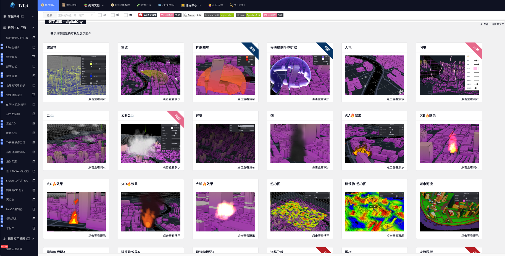

# 🧊 TvT.js 🧊
[简体中文](./README_zh.md) | English
## 🎉An open-source framework for rapid implementation of 3D visualization projects.
<p align="center">
		<a href="https://github.com/hawk86104/three-vue-tres" target="_blank">
			
		</a>
		
		
		<a target="_black" href="https://gitee.com/ice-gl/icegl-three-vue-tres">
			
		</a>
		</a>
			<a target="_black" href="https://gitcode.com/hawk86104/three-vue-tres">
			
		</a>
</p>



# Ecosystem: `@ThreeJS @Vue3.x @TresJS`

> Developed by icegl, permanently open-source and free for commercial use, with ongoing updates. Please click the star ⭐ in the upper right corner to follow.

This project integrates into three major ecosystems:

-   🎲 ThreeJS \* [Click for details](https://threejs.org)
		<a href="https://www.npmjs.com/package/three">
		
		</a>
		A renowned 3D library based on browser rendering using JavaScript.<br/><br/>

-   🍀 Vue3.x \* [Click for details](https://cn.vuejs.org)
		<a href="https://www.npmjs.com/package/vue">
		
		</a>
		A web frontend framework that is easy to learn and use, performs excellently, and supports a wide range of scenarios.<br/><br/>

-   ⚡ TresJS \* [Click for details](https://tresjs.org)
		<a href="https://www.npmjs.com/package/@tresjs/core">
		
		</a>
		An npm package that enables declarative ThreeJS using Vue3.x components, designed for building 3D projects in frontend development.<br/><br/>

## 🏕 Click to preview：[🌏 opensource.icegl.cn](https://opensource.icegl.cn)

-   If access is too slow, try Mirror Site 1：[🌏 oss.icegl.cn](http://oss.icegl.cn/)
-   If access is too slow, try Mirror Site 2：[🌏 myhome.217dan.com:8899](http://myhome.217dan.com:8899/)
-   github Mirror Site：[🌏 https://hawk86104.github.io](https://hawk86104.github.io/)

```shell
Since the project is frequently updated and compiled, if you encounter access errors, please clear your browser cache.
```

# Advantages

-   🌈 Frontend Fundamentals `FesJS` [Click for details](https://fesjs.mumblefe.cn)
<a href="https://www.npmjs.com/package/@fesjs/fes">

</a><br/>
Integrates commonly used libraries for project implementation: icons, multi-language support, API calls, Vuex/Pinia, model data encapsulation, page layout/permission access, and route management.<br/>
<br/>

-   🌠 Build 3D Visualization Projects Like Writing Vue3.x [Click for details](https://tresjs.org/guide)<br/>

<br/>
The npm full-featured version keeps up with the latest ThreeJS version. `TresJS` adopts the latest Vue3.x syntactic sugar and supports both TS/JS, allowing you to build 3D visualization projects in the most efficient and enjoyable way.

```html
<template>
    <TresCanvas window-size>
        <TresPerspectiveCamera />
        <TresMesh>
            <TresTorusGeometry :args="[1, 0.5, 16, 32]" />
            <TresMeshBasicMaterial color="orange" />
        </TresMesh>
    </TresCanvas>
</template>

<script setup lang="ts">
import { useRenderLoop, useTexture } from '@tresjs/core'

const pTexture = await useTexture(['./**.jpg', './**.png'])
const { onLoop } = useRenderLoop()
onLoop(({ delta }) => {

})
</script>
```
# ✅ Quick Start

```
1、git clone the repository or download this project directly.

2、Navigate to the project root directory with cd

3、yarn	//  Install dependencies.

4、yarn pre.dev // Debug mode for preview.

5、yarn dev // Debug mode for your own project.

6、yarn pre.build   // Compile and bundle for preview.

7、yarn build   // Compile and bundle for your own project.

8、yarn both    // Start both dev and pre.dev simultaneously, allowing you to debug your own project while referencing and porting examples and plugins.
```
# 📖 Documentation

## User Guide：[🌏docs.icegl.cn](https://docs.icegl.cn/)

# ❓ Issue Reporting

If you encounter any problems while using the project, please contact us through the following channels:

-   Q&A Community: [Graphics Community icegl.cn](https://www.icegl.cn/ask)

<a href="https://www.icegl.cn/ask">
</a>

-   We also welcome you to join our WeChat groups. Several groups are already full, so feel free to add me on WeChat, and I’ll invite you to join for learning and discussing WebGL together.
<p align = "left">    

</p>

# ⭐ Star History

[](https://star-history.com/#hawk86104/three-vue-tres&hawk86104/vue3-ts-cesium-map-show&Date)

# ™️ Copyright Information

This project is released under the Apache 2.0 open-source license, providing free lifetime use and allowing commercial applications.

> If you use this project for commercial purposes, please comply with the Apache 2.0 license and retain the author’s technical support acknowledgment.

-   For secondary development intended for commercial use or open-source competitors, please do not remove or modify the copyright, author statement, or source attribution at the top of the TvT.js source code.
-   Commercial use is allowed, but secondary open-sourcing and charging for it are prohibited.

The copyright information of third-party source code and binary files included in this project will be noted separately.

Follow our official WeChat account to receive the latest updates.
<p align = "left">    

</p>

Copyright © 2022-2026 by 🧊icegl (https://www.icegl.cn)

All rights reserved。
